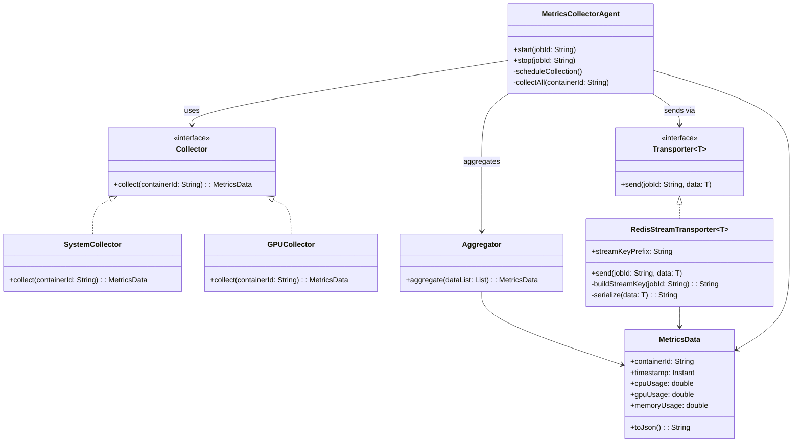
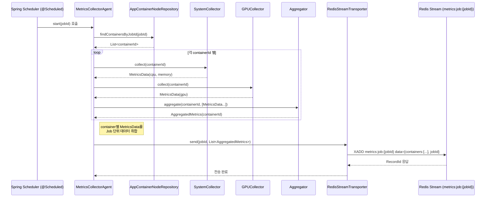
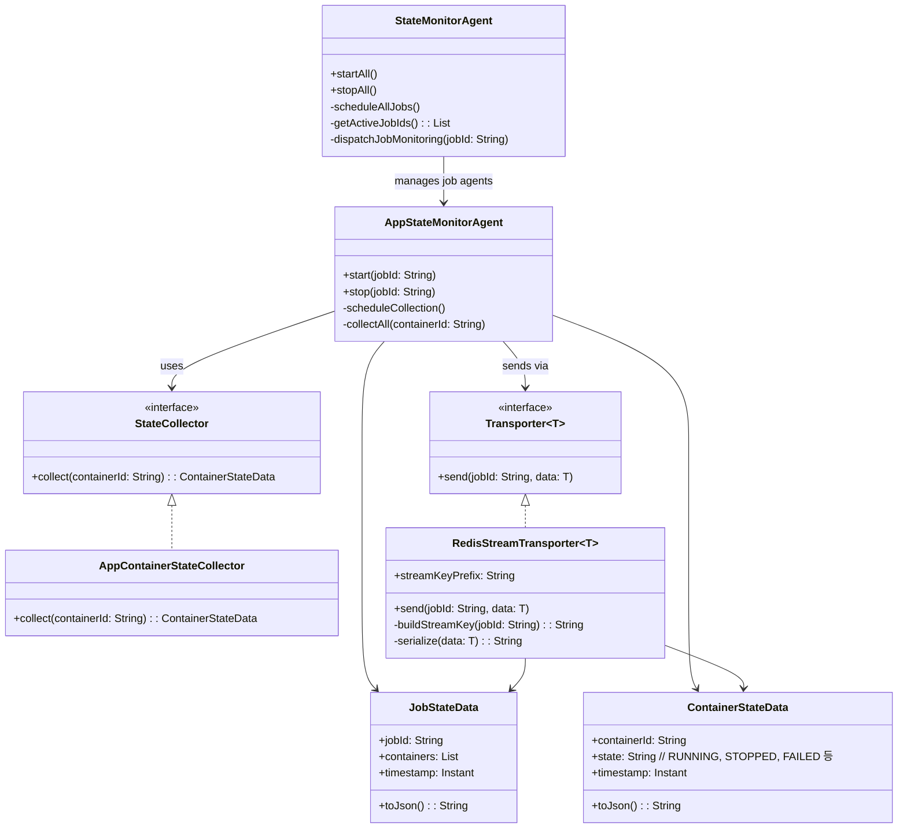
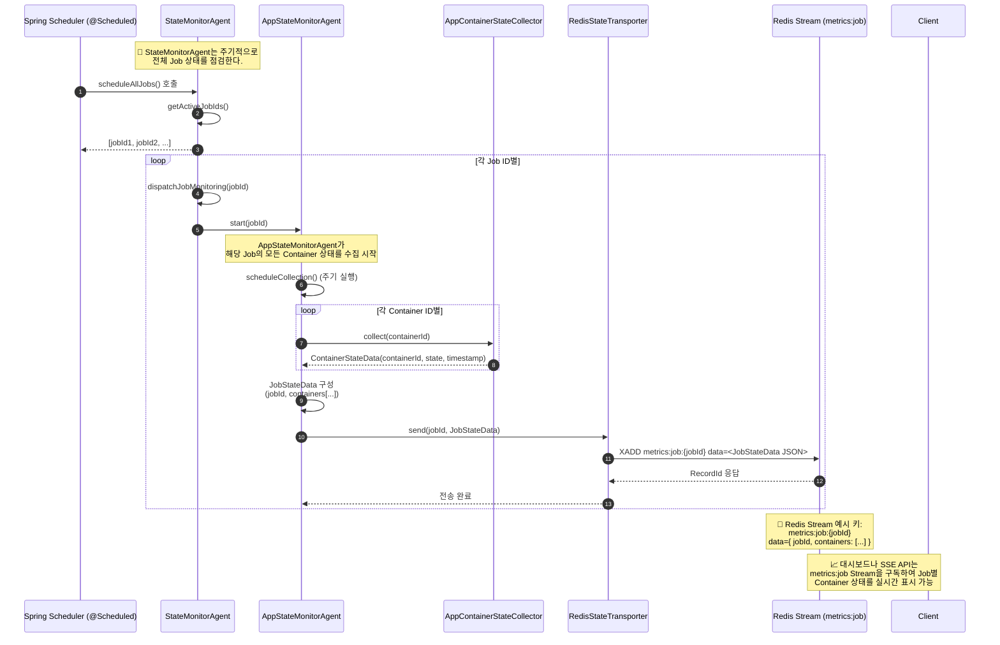
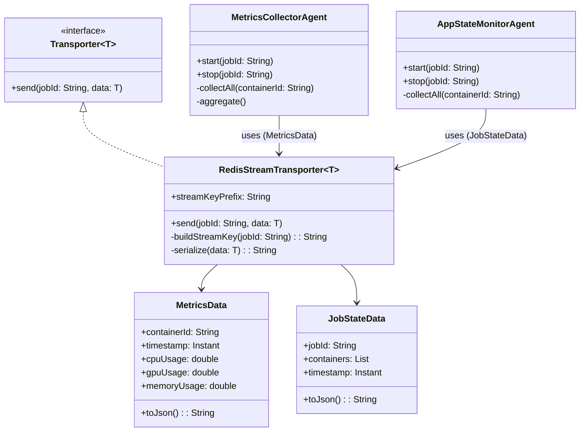

# 🧩 Redis Stream

- 리소스 사용률 메트릭
- Job 과 Container 상태 모니터링

## Redis Stream Key

| 항목 | 예시 | 설명 |  |
| --- | --- | --- | --- |
| Job 단위 리소스 사용률 메트릭 | `metrics:job:{jobId}`  | Job별 GPU/CPU 등 리소스 사용률 스트림 |  |
| Job 단위  App Container 상태 | `state:job:{jobId}` | Job별  App Container 상태를 스트림 |  |
| Job 상태 | `state:jobs:agg` | 모든 Job 상태를 스트림 |  |

# 🧩 리소스 사용률 메트릭

## Stream 데이터 구조

```json
XADD metrics:job:123 * data='{
	"jobId": "123", 
  "containers": [
    {
      "timestamp": "YYYY-MM-DDThh:mm:ssZ",
      "containerId": "abc",
      "cpuUsage": 32.4,
      "gpuUsage": 11.8,
      "memoryUsage": 65.2,
    },
    {
      "timestamp": "YYYY-MM-DDThh:mm:ssZ",
      "containerId": "def",
      "cpuUsage": 28.1,
      "gpuUsage": 9.3,
      "memoryUsage": 71.5,
    },
  ]
}'
```

## Class Diagram



## Sequence



# 🧩 Job & Container 상태

## Stream 데이터 구조

```json
XADD state:job:123 * data='{
			"jobId": "123", 
		  "containers": [
		    {
		      "timestamp": "YYYY-MM-DDThh:mm:ssZ",
		      "containerId": "abc",
		      "status": "COMPLETED"
		      "startTime": "YYYY-MM-DDThh:mm:ssZ",
		      "endTime": "YYYY-MM-DDThh:mm:ssZ"
		    },
		    {
		      "timestamp": "YYYY-MM-DDThh:mm:ssZ",
		      "containerId": "def",
		      "status": "RUNNING"
		      "startTime": "YYYY-MM-DDThh:mm:ssZ",
		      "endTime": "YYYY-MM-DDThh:mm:ssZ"
		    },
		  ]
}'
```

## Class Diagram



## Sequence



# 🧩 추가 Class Diagram

