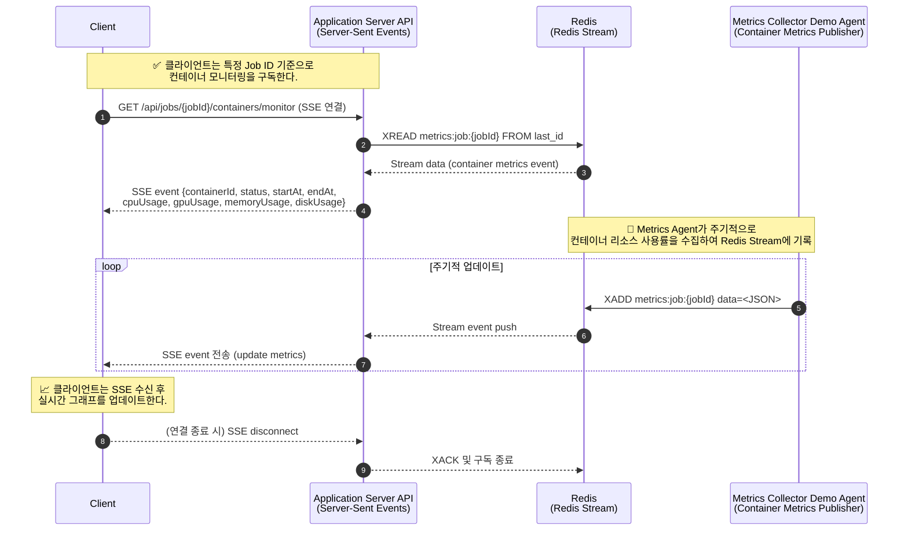

# 🧩 Jobs

## 🎈 Job CRUD

| Method | Endpoint | Description |
| --- | --- | --- |
| `POST` | `/api/jobs` | 새 Job 생성 |
| `GET` | `/api/jobs/{jobId}` | Job 상세 조회 |
| `PUT` | `/api/jobs/{jobId}` | Job 수정 |
| `DELETE` | `/api/jobs/{jobId}` | Job 삭제 |

## 🎈 Job list

| Method | Endpoint | Description |
| --- | --- | --- |
| `GET` | `/api/jobs` | Job 목록 조회 |

Job 정보를 응답한다.

### Response

- Job ID
- Label

## 🎈 Job list monitoring(SSE)

| Method | Endpoint | Description |
| --- | --- | --- |
| `GET` | `/api/jobs/monitor` | 전체 Job 상태 실시간 모니터링 (SSE) |

SSE로 구독자에게 실시간 Event를 응답한다.

Redis stream 사용

### Response

- Job ID
- 상태
- 실행 시작 시각
- 완료 시각
- 진행 Container Label

### Sequence

```json

```

## 🎈 App container list by job

| Method | Endpoint | Description |
| --- | --- | --- |
| `GET` | `/api/jobs/{jobId}/containers` | 특정 Job의 컨테이너 목록 조회 |

### Request

- Job ID

### Response

- Continer ID
- Label
- GPU  코어 수
- CPU  코어 수
- Memory 크기
- Disk 크기

## 🎈 App container list metrics monitoring by job(SSE)

| Method | Endpoint | Description |
| --- | --- | --- |
| `GET` | `/api/jobs/{jobId}/containers/metrics` | 특정 Job의 컨테이너 상태 실시간 모니터링 (SSE) |

SSE로 구독자에게 실시간 CPU, GPU등 metrics 정보를 Event로 응답한다.

Redis steam 사용

### Request

- Job ID

### Response

- Container 목록
    - Container ID
    - CPU 사용률
    - GPU 사용률
    - Memory 사용률
    - Disk  사용률

### Sequence



## 🎈 App container list container state monitoring by job(SSE)

| Method | Endpoint | Description |
| --- | --- | --- |
| `GET` | `/api/jobs/{jobId}/containers/state` | 특정 Job의 컨테이너 상태 실시간 모니터링 (SSE) |

SSE로 구독자에게 실시간 컨테이너 상태 Event를 응답한다.

Redis steam 사용

### Request

- Job ID

### Response

- Container 목록
    - Container ID
    - 상태
    - 실행 시작 시각
    - 완료 시각

## 🎈 Job 수동제어

| Method | Endpoint | Description |
| --- | --- | --- |
| `POST` | `/api/jobs/{jobId}/start` | 지정한 Job을 수동으로 시작 |
| `POST` | `/api/jobs/{jobId}/stop` | 실행 중인 Job을 수동으로 중지 |

# 🧩 App Container

## 🎈 App container CRUD

| Method | Endpoint | Description |
| --- | --- | --- |
| `POST` | `/api/containers` | 컨테이너 생성 |
| `GET` | `/api/containers/{containerId}` | 컨테이너 상세 조회 |
| `PUT` | `/api/containers/{containerId}` | 컨테이너 수정 |
| `DELETE` | `/api/containers/{containerId}` | 컨테이너 삭제 |

# 🧩 Resource Node

## 🎈 Resource node CRUD

| Method | Endpoint | Description |
| --- | --- | --- |
| `POST` | `/api/nodes` | 리소스 노드 등록 |
| `GET` | `/api/nodes/{nodeId}` | 리소스 노드 상세 조회 |
| `PUT` | `/api/nodes/{nodeId}` | 리소스 노드 수정 |
| `DELETE` | `/api/nodes/{nodeId}` | 리소스 노드 삭제 |